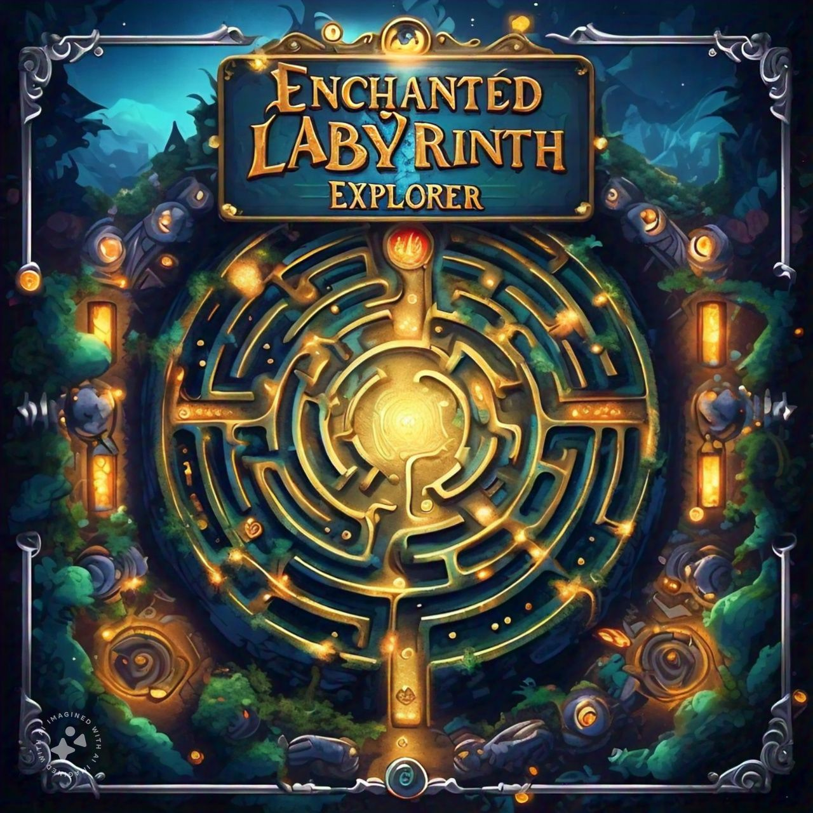

# Enchanted Labyrinth Explorer

## Overview
Enchanted Labyrinth Explorer is an immersive game developed in C++ that takes players on a journey through a magical maze filled with puzzles, challenges, and hidden treasures. Utilizing advanced Data Structures and Algorithms (DSA), the game provides a robust and engaging experience.

## Key Features
- **Dynamic Maze Generation**: The labyrinth is procedurally generated using arrays and linked lists to create a unique and challenging experience each time you play.
- **Efficient Pathfinding**: Implementing Dijkstra's algorithm ensures optimal pathfinding, allowing players to navigate the maze efficiently and strategically.
- **Complex Data Structures**: Trees and graphs are employed to manage the intricate relationships and pathways within the labyrinth, enhancing the depth and complexity of the game.
- **Interactive Gameplay**: Players can interact with various elements within the maze, solving puzzles and uncovering secrets that add to the overall adventure.

## Technologies Used
- **C++**: The core programming language used for developing the game.
- **Arrays**: For storing maze layout and game state information.
- **Linked Lists**: To handle dynamic elements within the game, such as items and obstacles.
- **Trees**: For managing hierarchical structures and decision-making processes in the game.
- **Graphs**: Essential for representing the labyrinth and enabling efficient navigation and pathfinding.
- **Dijkstra's Algorithm**: Ensures that players can find the shortest and most efficient paths through the maze.

## Installation
To play Enchanted Labyrinth Explorer, follow these steps:

1. Clone the repository:
    ```sh
      git clone https://github.com/saffimuhammadhashir/Enchanted-Labyrinth-Explorer.git
    cd Enchanted-Labyrinth-Explorer
    ```

2. Install SFML:
    Follow the instructions on the [SFML website](https://www.sfml-dev.org/download.php) to install SFML for your operating system.

3. Build the project:
    ```sh
    g++ -o labyrinth_explorer source.cpp -lsfml-graphics -lsfml-window -lsfml-system
    ```

4. Run the game:
    ```sh
    ./labyrinth_explorer
    ```

## Screenshots



Contribution
Contributions are welcome! If you have any ideas or improvements, please feel free to fork the repository and submit a pull request.

Enjoy your adventure through the Enchanted Labyrinth!
